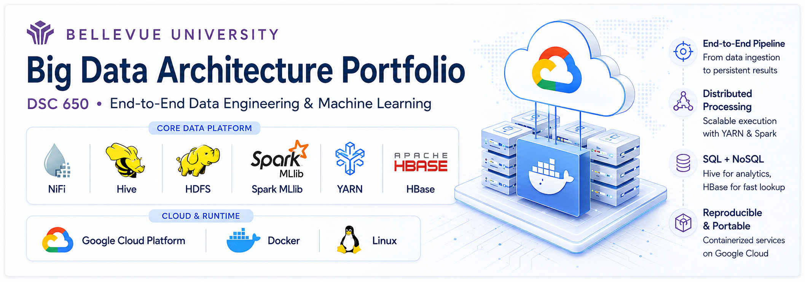
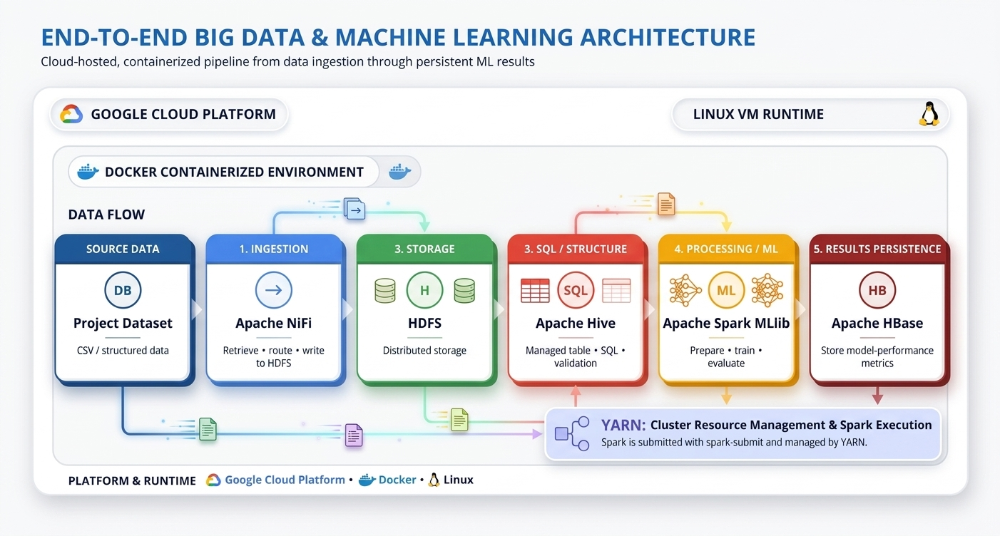
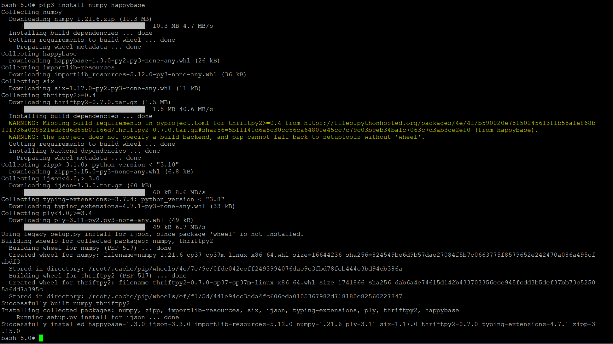
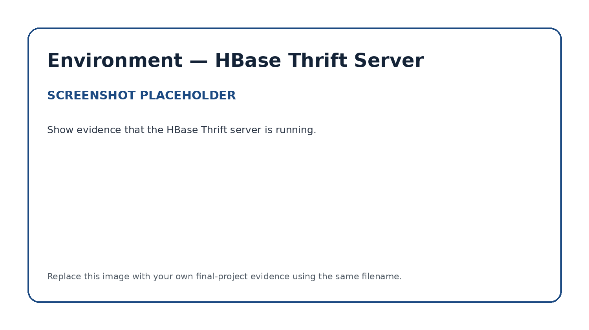

<p align="center">
  
</p>

# DSC 650 — Big Data Architecture Final Project

> **End-to-end data engineering and machine learning pipeline built across the Hadoop ecosystem.**  
> **Platform & Runtime:** Google Cloud Platform • Docker • Linux

## Project Overview

This project delivers a complete big data pipeline that integrates **Apache NiFi, HDFS, Hive, Spark MLlib, YARN, and HBase** into a single end-to-end architecture, deployed in a **Docker-based environment on Google Cloud Platform**.

The implementation demonstrates how distributed data platforms work together to move data from ingestion through distributed storage, SQL access, machine learning, and persistent NoSQL results. The project combines **cloud infrastructure, containerization, data engineering, distributed processing, machine learning, cluster resource management, and system integration** in one working pipeline.

### End-to-End Data Flow

**Source Data → Apache NiFi → HDFS → Apache Hive → Apache Spark MLlib → Apache HBase**

Spark workloads are submitted through **YARN** for cluster resource management and execution. The platform runs in a **Docker-containerized environment hosted on Google Cloud Platform**, providing an isolated and reproducible runtime for the distributed services.

At a high level, the pipeline performs the following:

1. **Apache NiFi** retrieves the source dataset and writes it into **HDFS**.
2. **HDFS** provides the distributed storage layer for the ingested data.
3. **Apache Hive** creates a managed table and exposes the stored data through **SQL**.
4. **Apache Spark MLlib** reads the project data from Hive, prepares the data, trains a machine learning model, and evaluates the model.
5. **YARN** manages execution of the Spark workload across the cluster.
6. **Apache Spark** writes model-performance metrics into **Apache HBase**.
7. **Apache HBase** scans verify that the machine learning metrics were successfully persisted.

This repository preserves the architecture, source code, SQL, flow definitions, execution evidence, and results so the implementation can be reviewed even after the original Google Cloud environment is no longer running.

---

## Architecture

<p align="center">
  
</p>

The architecture intentionally combines technologies that serve different responsibilities within the same pipeline:

| Layer | Technology | Responsibility |
|---|---|---|
| Cloud Infrastructure | Google Cloud Platform | Hosts the compute environment used to run the distributed platform |
| Container Runtime | Docker | Provides isolated, reproducible service environments and networking |
| Ingestion | Apache NiFi | Retrieve, route, and deliver source data into the platform |
| Storage | HDFS | Persist the ingested dataset in distributed storage |
| SQL / Structure | Apache Hive | Create a managed table and provide SQL-based validation and aggregation |
| Processing / ML | Apache Spark MLlib | Read Hive data, transform features, train a model, and evaluate results |
| Resource Management | YARN | Schedule and manage the Spark workload across cluster resources |
| Results Persistence | Apache HBase | Store and retrieve model-performance metrics generated by Spark |

The result is a traceable data path from raw source data to persistent analytical output.

---

## Engineering Capabilities Demonstrated

| Capability | Implementation Evidence |
|---|---|
| Cloud deployment | Multi-service environment hosted on Google Cloud Platform |
| Containerization | Docker-based service deployment, isolation, and networking |
| Data ingestion | NiFi flow design, processor execution, and queue activity |
| Distributed storage | HDFS listing confirming successful ingestion |
| SQL data engineering | Hive managed-table creation, loading, querying, and aggregation |
| Distributed processing | PySpark execution against Hive-backed data |
| Machine learning | Spark MLlib training and model evaluation |
| Cluster execution | `spark-submit` through YARN with execution logs and final output |
| NoSQL data modeling | HBase table, row-key, and column-family design |
| Cross-system integration | Spark-generated model metrics persisted into HBase |
| End-to-end validation | Evidence from NiFi, HDFS, Hive, Spark, YARN, and HBase |

---

## Repository Structure

```text
dsc650-big-data-final/
│
├── README.md
│
├── architecture/
│   └── architecture-diagram.png
│
├── nifi/
│   ├── README.md
│   ├── flow-definition.json
│   └── screenshots/
│       ├── nifi-flow.png
│       ├── nifi-running.png
│       └── hdfs-ingestion-verification.png
│
├── hive/
│   ├── README.md
│   ├── create_tables.sql
│   ├── queries.sql
│   └── screenshots/
│       ├── hive-load-results.png
│       └── hive-query-results.png
│
├── spark/
│   ├── README.md
│   ├── processing.py
│   ├── analysis.py
│   └── screenshots/
│       ├── spark-training-output.png
│       ├── spark-ml-evaluation.png
│       └── spark-submit-output.png
│
├── hbase/
│   ├── README.md
│   ├── commands.txt
│   └── screenshots/
│       ├── hbase-empty-scan.png
│       └── hbase-populated-scan.png
│
└── docs/
    ├── project-summary.md
    └── screenshots/
        ├── package-installation.png
        └── hbase-thrift-server.png
```

The portfolio is organized by technology and engineering function so the implementation can be followed from ingestion through machine learning and final persistence.

---

## Apache NiFi — Data Ingestion & Orchestration

Apache NiFi provides the entry point to the pipeline. The flow retrieves the source dataset, routes the data through the configured processors, and writes the resulting records into HDFS.

This stage demonstrates automated acquisition, processor-based flow design, routing, distributed-storage integration, and operational verification.

<p align="center">
  
</p>

<p align="center">
  
</p>

<p align="center">
  
</p>

**Implementation details:** [`nifi/README.md`](nifi/README.md)  
**Flow definition:** [`nifi/flow-definition.json`](nifi/flow-definition.json)

---

## HDFS — Distributed Storage

HDFS provides the persistent distributed storage layer between ingestion and downstream analytics. After NiFi completes ingestion, command-line verification confirms that the dataset is present and available for Hive.

This stage demonstrates distributed file storage, separation of storage from compute, and integration between NiFi and the Hadoop ecosystem.

---

## Apache Hive — Managed SQL Data Layer

Apache Hive provides the structured SQL layer for the pipeline. A managed Hive table is created from the HDFS-backed project data, allowing the dataset to be validated and queried before machine learning begins.

The Hive implementation demonstrates schema definition, managed-table creation, data loading, SQL validation, and aggregation.

<p align="center">
  
</p>

<p align="center">
  
</p>

**Implementation details:** [`hive/README.md`](hive/README.md)  
**Table definitions:** [`hive/create_tables.sql`](hive/create_tables.sql)  
**Queries:** [`hive/queries.sql`](hive/queries.sql)

---

## Apache Spark MLlib — Distributed Machine Learning

Apache Spark provides the distributed processing and machine learning layer. The PySpark application reads project data from Hive, performs the transformations required for modeling, trains a machine learning model using Spark MLlib, evaluates the model, and produces measurable performance metrics.

The application is submitted using `spark-submit` through YARN, demonstrating cluster-managed execution rather than local-only processing.

<p align="center">
  
</p>

<p align="center">
  
</p>

<p align="center">
  
</p>

**Implementation details:** [`spark/README.md`](spark/README.md)  
**PySpark source:** [`spark/`](spark/)

---

## YARN — Cluster Resource Management

YARN provides the resource-management layer used to execute the Spark workload. The `spark-submit` execution demonstrates how distributed applications are launched, scheduled, and managed across the Hadoop environment.

Execution logs and final output provide operational evidence that the Spark application completed successfully.

---

## Apache HBase — NoSQL Metrics Persistence

Apache HBase provides persistent NoSQL storage for the machine learning results.

The target HBase table is created before Spark runs and is first verified with an empty scan. After Spark completes training and evaluation, model-performance metrics are written into HBase. A final scan verifies that the results were successfully persisted.

<p align="center">
  
</p>

<p align="center">
  
</p>

**Implementation details:** [`hbase/README.md`](hbase/README.md)  
**HBase commands:** [`hbase/commands.txt`](hbase/commands.txt)

---

## Environment & Integration Evidence

The implementation also captures the supporting environment configuration required to connect Spark and HBase, including package installation and HBase Thrift server startup.

<p align="center">
  
</p>

<p align="center">
  
</p>

**Project summary:** [`docs/project-summary.md`](docs/project-summary.md)

---

## End-to-End Execution Evidence

A distributed engineering project requires both source code and evidence that the individual services operated together successfully.

| Pipeline Stage | Verification |
|---|---|
| NiFi | Completed flow and successful processor execution |
| HDFS | `hdfs dfs -ls` confirms the ingested dataset |
| Hive | Managed-table creation, data load, SQL queries, and aggregation |
| Spark MLlib | Training output and machine learning evaluation metrics |
| YARN | Successful `spark-submit` execution and application output |
| HBase — Before Spark | Empty scan confirms the metrics table is ready |
| HBase — After Spark | Populated scan confirms Spark persisted model metrics |
| Architecture | End-to-end data-flow diagram connecting the services |
| Source Code | NiFi flow, Hive SQL, PySpark application, and HBase commands |

Together, these artifacts provide traceable evidence that the pipeline executed from beginning to end.

---

## Technology Decisions

| Technology | Role in the Architecture | Engineering Value |
|---|---|---|
| Apache NiFi | Data ingestion and orchestration | Provides configurable and traceable movement of source data into the platform |
| HDFS | Distributed storage | Provides durable distributed persistence and separates storage from compute |
| Apache Hive | SQL data layer | Adds structured schemas and SQL-based validation over distributed data |
| Apache Spark MLlib | Processing and machine learning | Combines distributed computation with scalable model training and evaluation |
| YARN | Resource management | Schedules and manages distributed Spark workloads across cluster resources |
| Apache HBase | NoSQL results store | Persists Spark-generated metrics for direct retrieval and verification |
| Google Cloud Platform | Cloud infrastructure | Provides the compute environment used to deploy and operate the multi-service architecture |
| Docker | Container runtime | Provides isolated, reproducible service environments and networking for the distributed stack |
| Linux | Operating system | Provides the underlying runtime for the cloud-hosted Docker environment |

This design demonstrates a core distributed-systems principle: each technology performs the workload it is best suited for while participating in a cohesive end-to-end pipeline.

---

## Engineering Skills Demonstrated

This project provides practical experience across multiple areas of modern data engineering and distributed systems:

- Deploying and operating a multi-service environment on Google Cloud Platform
- Working with Docker-based service isolation and networking
- Designing a multi-stage data pipeline
- Building and troubleshooting NiFi data flows
- Working with distributed storage in HDFS
- Creating and querying managed Hive tables
- Developing PySpark applications
- Applying machine learning with Spark MLlib
- Submitting distributed workloads through YARN
- Designing and validating HBase tables
- Persisting analytical results between distributed systems
- Troubleshooting service connectivity and resource constraints
- Validating pipeline stages through logs, queries, commands, and scans
- Documenting a complex technical implementation for future review

---

## Cloud, Container & Runtime Environment

The project environment is deployed on **Google Cloud Platform** using temporary educational cloud resources. The distributed services run in a **Docker-containerized environment on Linux**, providing service isolation, repeatability, and a consistent runtime across the project stack.

The live infrastructure is not required for this portfolio to remain useful. The repository preserves the technical implementation through source code, Hive SQL, NiFi flow definitions, HBase commands, architecture diagrams, screenshots, Spark execution evidence, machine learning results, and implementation documentation. Together, **Google Cloud provides the infrastructure layer while Docker provides the containerized runtime for the distributed services**.

This approach keeps the project reviewable after the temporary cloud environment has been decommissioned.

---

## Security & Publishing

The repository is designed to showcase technical work without exposing sensitive environment information.

Public portfolio content should exclude:

- passwords and credentials;
- API keys and access tokens;
- private keys and certificates;
- sensitive or restricted datasets;
- personally identifiable information;
- environment-specific secrets;
- instructor solution material.

The included [`.gitignore`](.gitignore) provides an additional safeguard against committing common credential and local-environment files.

---

## Portfolio Outcome

This repository provides a permanent technical record of a working distributed data architecture.

> **Ingest → Store → Structure → Process → Learn → Persist → Verify**

A reviewer can use the architecture, source code, SQL, screenshots, execution output, and component documentation to understand both how the system works and how the implementation was validated.
