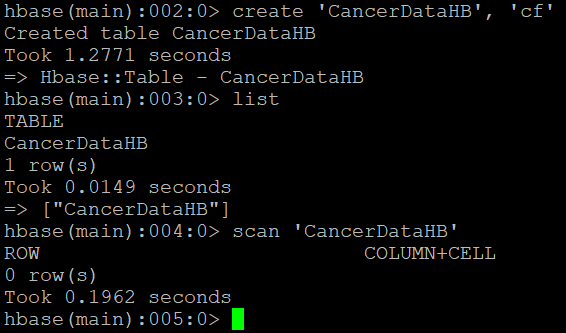
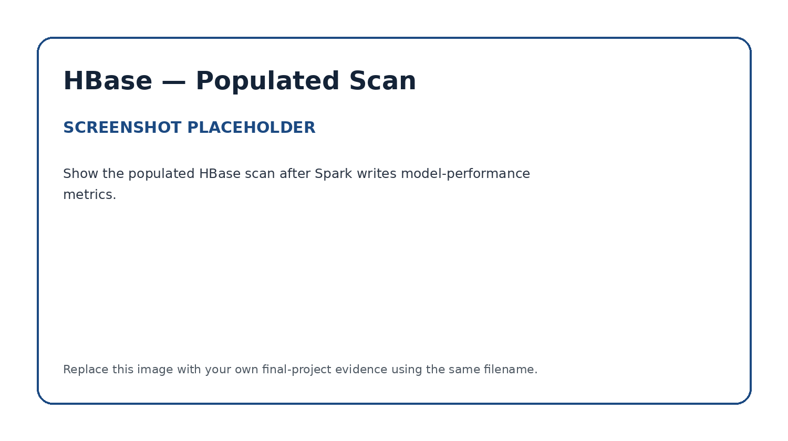

# Apache HBase — Model Metrics Persistence

## Role in the Pipeline

Apache HBase provides the NoSQL persistence layer for the machine learning metrics generated by Spark MLlib.

The HBase table is created before the Spark job runs, verified with an empty scan, populated by the PySpark application, and scanned again after execution to confirm that the model-performance metrics were successfully stored.

## Table Design

**Table name:** `CancerDataHB`  
**Row key:** `[last 4 ID ####]:[Diagnosis M/B]:[Radiius Mean in Format ##.##]`  
**Column family/families:** `cf`

Explain why the selected row key and column family design are appropriate for the model metrics being stored.

The row key includes the last 4 ID digits, the diagnosis result and the radius mean.  This is unique enough so that data shouldn't be mixed together and provides a good way to sort the data.  An example from the data would be '5715:M:13.17'

I chose a single column family, 'cf', because the data size is quite small and increasing the column families unnecessarily increases computation and resources required. 

## HBase Commands

The commands used to create and inspect the table are stored in:

[`commands.txt`](commands.txt)

## Empty Table Verification

Explain how the initial empty scan confirms that the target table exists before Spark writes any metrics.

The initial scan shows that there are 0 rows in the newly created table, so the table is empty with no data.

## Metrics Written by Spark

List the model-performance metrics written into HBase.

Examples may include accuracy, precision, recall, F1 score, RMSE, MAE, or another metric appropriate for the selected MLlib algorithm.

Explain how these values represent the output of the Spark machine learning workflow.

## Populated Table Verification

Explain how the final populated scan confirms that Spark successfully wrote the model metrics into HBase.

This final scan provides end-to-end verification that the pipeline successfully moved from ingestion and distributed storage through SQL access, machine learning, and persistent NoSQL results.
