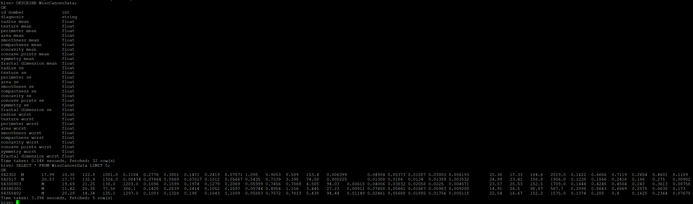
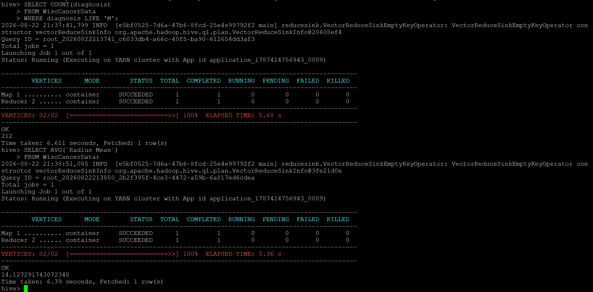

# Apache Hive — Managed Table & SQL Validation

## Role in the Pipeline

Apache Hive provides the structured SQL layer between HDFS storage and the Spark MLlib workload. The project data loaded through NiFi into HDFS is used to create and populate a Hive managed table.

## Hive Table Design

**Table name:** `WiscCancerData`

The data consists of ID Numbers, a diagnosis ('M' or 'B' for malignant or benign), and 10 cell growth measurements measured in 3 different ways each, for a total of 30 features.  There are 569 items with no null values.

`ID Number` INT,
`Diagnosis` STRING,
`Radius Mean` FLOAT,
`Texture Mean` FLOAT,
`Perimeter Mean` FLOAT,
`Area Mean` FLOAT,
`Smoothness Mean` FLOAT,
`Compactness Mean` FLOAT,
`Concavity Mean` FLOAT,
`Concave Points Mean` FLOAT,
`Symmetry Mean` FLOAT,
`Fractal Dimension Mean` FLOAT,
`Radius SE` FLOAT,
`Texture SE` FLOAT,
`Perimeter SE` FLOAT,
`Area SE` FLOAT,
`Smoothness SE` FLOAT,
`Compactness SE` FLOAT,
`Concavity SE` FLOAT,
`Concave Points SE` FLOAT,
`Symmetry SE` FLOAT,
`Fractal Dimension SE` FLOAT,
`Radius Worst` FLOAT,
`Texture Worst` FLOAT,
`Perimeter Worst` FLOAT,
`Area Worst` FLOAT,
`Smoothness Worst` FLOAT,
`Compactness Worst` FLOAT,
`Concavity Worst` FLOAT,
`Concave Points Worst` FLOAT,
`Symmetry Worst` FLOAT,
`Fractal Dimension Worst` FLOAT

## SQL Files

- [`create_tables.sql`](create_tables.sql) — table creation and data-loading SQL
- [`queries.sql`](queries.sql) — validation, exploration, and aggregation queries

## Data Load Verification

Explain how you confirmed that the data was successfully loaded into the managed Hive table.

## Query & Aggregation Verification

Describe the representative queries used to validate the populated table. Include at least one aggregation query and explain what the results demonstrate about the dataset and schema.

The validated Hive table becomes the structured input used by the PySpark MLlib application.
