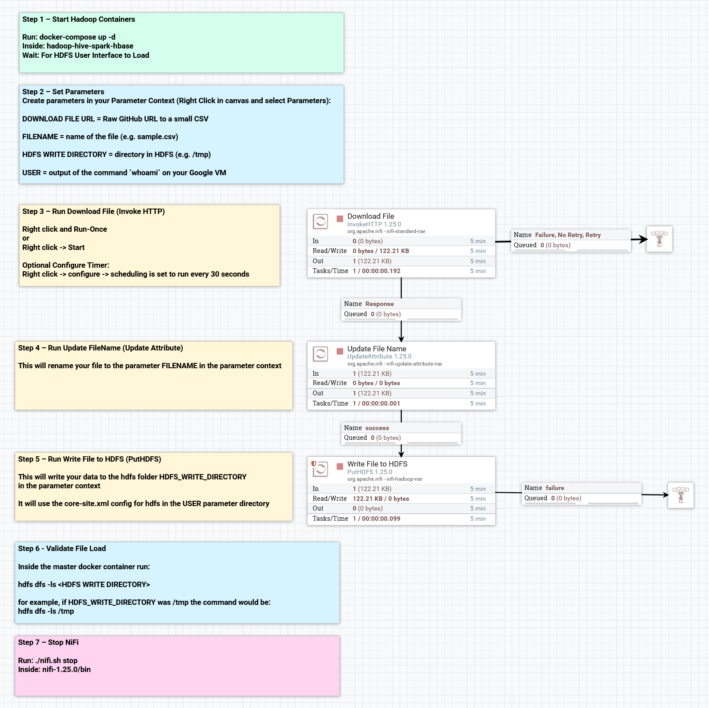
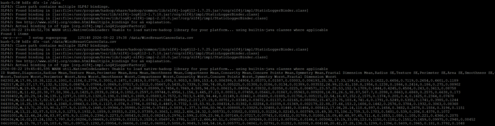

# Apache NiFi — Data Ingestion into HDFS

## Role in the Pipeline

Apache NiFi provides the ingestion and orchestration layer for this project. The completed flow retrieves the project dataset and writes it into HDFS for downstream processing.

## Source Dataset

**Dataset:** Breast Cancer Wisonsin (Diagnostic)
**GitHub direct URL:** 

https://raw.githubusercontent.com/tm8step/BigData/refs/heads/main/sample-data/WiscBreastCancerData.csv

I chose to work with the dataset 'Breast Cancer Wisconsin (Diagnostic)'. It has a CC BY 4.0 license, which allows sharing and adaptation when properly cited. The data has 569 instances of breast cancer data with patient ID, diagnosis, and 30 features. There are no null values, and the diagnoses are split into 357 benign instances and 212 malignant instances.  The features are 10 distinct features of cell masses with a mean, standard error and a worst mean (mean of the 3 largest) for each feature, totaling 30 measurements.

Source: https://archive.ics.uci.edu/dataset/17/breast+cancer+wisconsin+diagnostic

Citation:  Wolberg, W., Mangasarian, O., Street, N., & Street, W. (1993). Breast Cancer Wisconsin (Diagnostic) [Dataset]. UCI Machine Learning Repository. https://doi.org/10.24432/C5DW2B.

## Flow Design

| Processor / Process Group | Role in the Flow |
|---|---|
| Download File | Downloads the file from the Github repository and starts it in the Nifi data Flow|
| Update File Name | Renames the filename to the given filename in the parameter context |
| Write File to HDFS | Writes the data to the HDFS folder given in the parameter context.  In this case, the folder is '/tmp' |

Explain how data moves from the source URL through NiFi and into HDFS.

Data is downloaded into the Nifi dataflow from the github source.  It is then processed to have it's filename updated, and written to the HDFS in the /tmp folder.

## HDFS Destination

**HDFS path:** `[Enter final HDFS path]`

Explain where NiFi writes the dataset and how the destination is used by the next stage of the pipeline.

## Execution Evidence

### Final NiFi Flow

### Running Flow / Queue Activity

### HDFS Ingestion Verification

The HDFS screenshot should show the `hdfs dfs -ls` output confirming that the project dataset was successfully written into HDFS.
