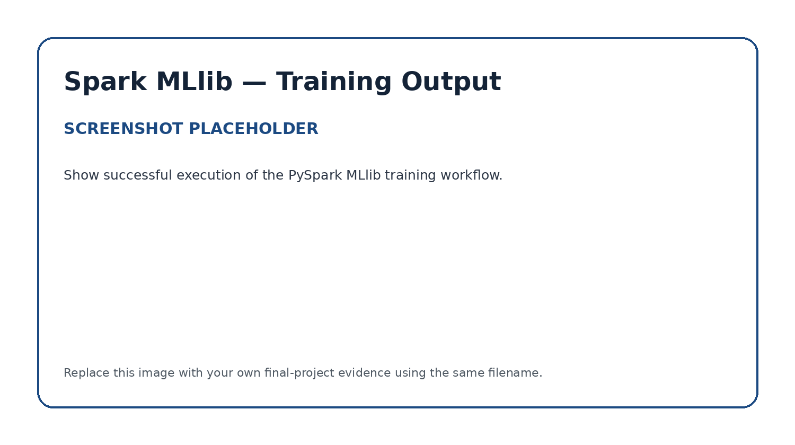
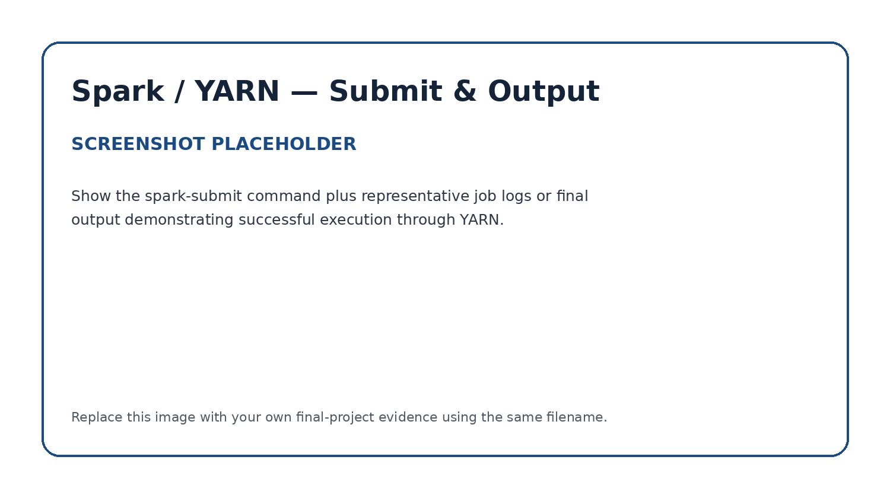

# Apache Spark MLlib — Distributed Machine Learning

## Role in the Pipeline

Apache Spark MLlib provides the distributed processing and machine learning layer for this project. The PySpark application reads project data from Hive, prepares the data for modeling, trains and evaluates a machine learning model, and generates model-performance metrics that are written into HBase.

## Hive Input

**Hive table:** `[WiscCancerData]`

Hive reads 569 rows of cancer data, with an ID, diagnosis and 30 feature fields describing statistical measurements of cell nuclei.

## Data Preparation & Transformations

I renamed the columns from the original table to denote each feature, particularly whether the feature was a mean, a standard error measurement or a mean of the worst 3.  I added the postfixes '_ Mean', '_ SE' and '_ Worst' for each.

Examples may include:

- selecting relevant features;
- handling missing values;
- encoding categorical fields;
- assembling feature vectors;
- scaling or normalization;
- creating training and test datasets.

## MLlib Algorithm

**Algorithm:** `[Logistic Regression]`

Explain:

- why this algorithm was appropriate for the selected dataset

Logistic Regression was appropriate because I wanted to classify the data into benign or malignant.

- what prediction or modeling task it performs;


- which features and target/label are used.

The target is whether the cells are malignant or benign, and the features are 10 measurements of the cell nucleus, with 3 statistical characteristics of each (mean, standard error and Mean of Worst 3).  10 measurements wtih 3 characteristics each totals 30 features.

## Training & Evaluation

Summarize the training process and explain the evaluation metric or metrics used.

**Primary evaluation metric(s):** `[Enter metric(s)]`

Explain what the resulting values indicate about model performance.

### Training Output



### Model Evaluation


## Spark Submit / YARN Execution

Document the exact `spark-submit` command used to submit the PySpark application through YARN.

```bash
# Paste your spark-submit command here
```

Briefly describe the successful execution and any important log or output information.



## HBase Output

List the model-performance metrics written by Spark into HBase and explain how the application connects the machine learning stage to the final persistence layer.

**PySpark source files:** [`processing.py`](processing.py) and/or [`analysis.py`](analysis.py)
